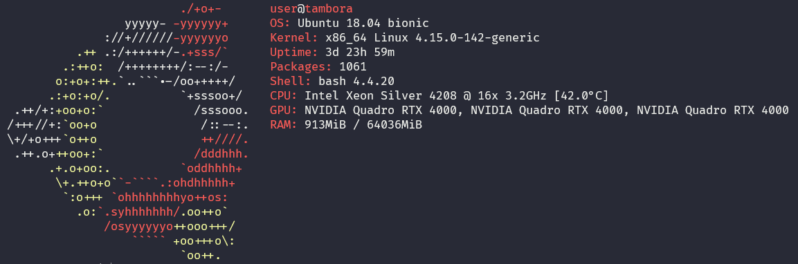

# Server Tambora

## Cara Akses

### Requirements

- [ ] Setup VPN untuk ITB ([ikuti dari DITSTI](https://ditsti.itb.ac.id/en/instalasi-dan-konfigurasi-openvpn-itb/))
  - [ ] Biasanya Download [OpenVPN](http://vpn.itb.ac.id/openvpn/Windows/openvpn-install-2.4.0-I601.exe) dan setup [Konfigurasi](http://vpn.itb.ac.id/openvpn/Windows/config-vista.exe)
- [ ] Buat akun dengan mengakses Jupyterhub Server dan membuat akun baru dengan user berupa nim anda
- [ ] Request ke Admin dengan menggunakan email std.stei dengan mengisi form akses
- [ ] Setelah itu anda akan mendapatkan email berisi google sheets
- [ ] Setelah mengisi google sheets silahkan pergunakan server sesuai dengan jadwal yang anda telah booking
