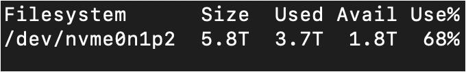

# Server Tambora S2 IF STEI ITB


## Spesifikasi sistem

### CPU

Intel Xeon Silver 4208 @3.2GHz (x2, 16C/32T total)

### Memori (RAM)

256GB DDR4-2666

> Catatan: Penggunaan RAM tiap pengguna dibatasi 128GB

### GPU


### Penyimpanan



## Akses server

### Tautan server

[JupyterHub](https://simanis.stei.itb.ac.id/)

### Pendaftaran

- Daftarkan akun JupyterHub Anda di server dengan **NIM sebagai username**
- Dengan akun Google Workspace STEI, isi [form akses server](https://forms.gle/fbpLT9gtQQm1GcXWA)
- Setelah admin melakukan aktivasi akun, admin akan mengontak melalui WhatsApp. Admin akan memberikan tautan grup pengguna server dan arahan awal
- Gabung ke grup WhatsApp server untuk mendapatkan informasi terbaru dan melakukan koordinasi dengan admin maupun pengguna server lainnya

### Penggunaan

- Isi spreadsheet reservasi server (tautan di grup WhatsApp) sesuai dengan waktu penggunaan dan pilihan GPU yang diinginkan
- Buka server di peramban web dan masuk dengan kredensial Anda
- Gunakan server sesuai reservasi yang telah dibuat

### Booking spreadsheet & resource sharing policy

- Spreadsheet hanya perlu diisi jika hendak menggunakan pemrosesan GPU atau pemrosesan-CPU-berat
- Penggunaan biasa, seperti mengunggah data, tidak perlu mengisi spreadsheet
- Spreadsheet akan dikosongkan setiap Senin pukul 3 sore
- Admin berhak menghentikan proses yang melanggar aturan di atas
- Admin berhak memberikan sanksi pada pelanggar aturan tersebut, mulai dari teguran hingga larangan penggunaan server, baik sementara maupun permanen

## Software server

### Tangkapan layar JupyterHub


Berikut beberapa software yang tersedia pada server.
- [JupyterHub](https://github.com/jupyterhub/jupyterhub)
  - Antarmuka pengguna seluruhnya menggunakan JupyterHub
  - Terdapat terminal untuk menjalankan perintah Linux
- Git LFS
- Python 3.10
  - Versi Python bawaan JupyterHub
  - Conda untuk environment tambahan
  - PyTorch dan TensorFlow

### Cara pasang package/aplikasi tambahan

- Package pip (user installation)

  `pip install --user package_name`

- Menjalankan executable

  Seharusnya executable dapat langsung dijalankan.

- Package conda, aplikasi Ubuntu (via apt), package pip (system-wide)

  Isi [form ini](https://forms.gle/pR64RAPc8V3bGeGx8) untuk melakukan request pemasangan software lainnya.

## Catatan-catatan

### Lupa kata sandi

Saat ini, belum tersedia fasilitas reset kata sandi. Apabila lupa kata sandi, Anda perlu menghubungi admin untuk melakukan reset akun. Reset akun **tidak memengaruhi** data yang tersimpan selama akun JupyterHub menggunakan username yang sama.

### Unggahan data

Ukuran berkas (file) maksimal yang dapat diunggah ke server melalui JupyterHub adalah 10 GB. Apabila ukuran berkas lebih besar dari 10 GB, gunakan metode lain untuk mengunggah seperti menggunakan GDown ([Tutorial](https://docs.google.com/presentation/d/1vH9s52eKXUIV9fZaYlJ8C1Za2p2MZIlilscoF3Vxmwg/view))

### Data pengguna

<span style="color:red">PENTING!</span> Mohon selalu sediakan cadangan (backup) dari data Anda di server. Server mungkin mengalami gangguan atau kerusakan yang dapat berdampak terhadap data Anda. <span style="color:red">Admin tidak bertanggung jawab atas kerusakan atau kehilangan data pengguna.</span>

### Memory management

Untuk menghindari kebocoran memori (RAM) server, selalu lakukan **kernel shutdown** (Kernel -> Shut Down Kernel) pada notebook/console setelah proses training selesai dan pastikan untuk melakukan **server shutdown** (File -> Hub Control Panel -> Stop My Server) setelah sesi penggunaan server selesai.

### Penggunaan Nvidia RTX A5000

Untuk menggunakan Nvidia RTX A5000 dengan PyTorch, versi minimal PyTorch yang dibutuhkan adalah 1.13.1+cu117. Untuk memeriksa versi PyTorch dapat diperiksa melalui atribut `__version__` dari modul PyTorch. Berikut contoh kode Python untuk mengecek versi PyTorch:
```Python
import torch
print(torch.__version__)
```

## Sitasi

Jika Anda menggunakan fasilitas server Tambora baik untuk keperluan akademik, mohon cantumkan “Server Riset Akademik Tambora” pada bagian acknowledgment atau sejenisnya pada laporan ataupun publikasi yang Anda hasilkan sebagai bentuk apresiasi 😁🙏

## [Pertanyaan lainnya (FAQ)](./FAQ.md)

## Kontak kami

### [Christopher - Admin S2](18221115@std.stei.itb.ac.id)

### [Aufar - Admin S1](18221163@std.stei.itb.ac.id)