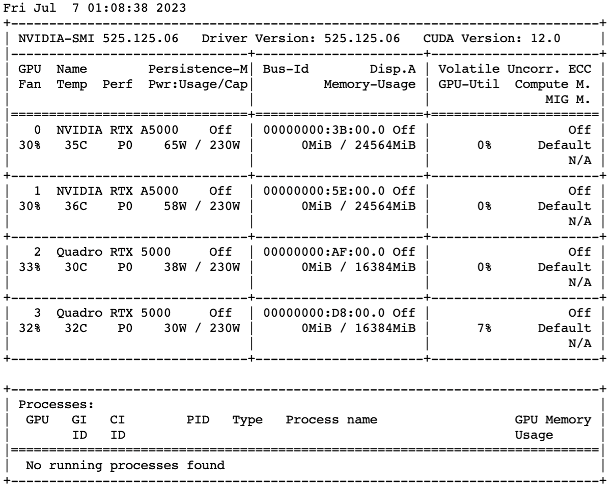

# Server Tambora

## Cara Akses

### Requirements

- [ ] Setup VPN untuk ITB ([ikuti dari DITSTI](https://ditsti.itb.ac.id/en/instalasi-dan-konfigurasi-openvpn-itb/))
  - [ ] Biasanya Download [OpenVPN](http://vpn.itb.ac.id/openvpn/Windows/openvpn-install-2.4.0-I601.exe) dan setup [Konfigurasi](http://vpn.itb.ac.id/openvpn/Windows/config-vista.exe)
- [ ] Dengan VPN aktif, Buat akun dengan mengakses [Jupyterhub Server](http://167.205.32.108/hub/) dan **dengan user berupa nim anda**
- [ ] Request ke Admin dengan **menggunakan email std.stei** dengan mengisi [form akses](https://forms.gle/fbpLT9gtQQm1GcXWA).
- [ ] Setelah itu anda akan mendapatkan email berisi google sheets booking server dan discord server untuk FAQ, Bug Report, info maintenance, dll.
- [ ] Setelah mengisi google sheets silahkan pergunakan server sesuai dengan jadwal yang telah anda booking.

## Current Installed Program

- git and git-lfs
- python 3.7 as default
  - conda untuk environment tambahan
  - pytorch dan tensorflow package default
- 

## Pertanyaan Lain

## Other Specs

### NVIDIA

### CPU

### Threads

### Storage

> Dua storage belum di mount, untuk saat ini hanya 1TB space
